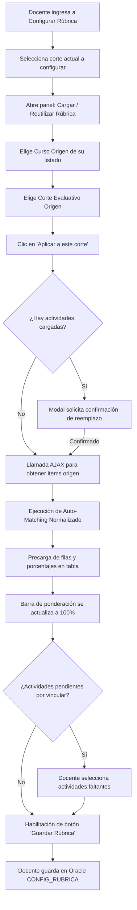

# Bitácora Día 5: Reutilización e Importación de Rúbricas entre Cursos/Grupos

Este documento describe la arquitectura técnica, lógica de auto-matching, flujo de persistencia y componentes de interfaz implementados durante la jornada del Día 5 para permitir a los docentes reutilizar o importar rúbricas configuradas previamente entre distintos cursos, grupos y cortes evaluativos en Divisist.

---

## 1. Objetivo de la Jornada
Implementar una solución integral para que el docente pueda:
1. **Reutilizar rúbricas evaluativas** previamente configuradas en otros de sus cursos/grupos o cortes académicos hacia el curso y corte actual.
2. **Consultar de manera dinámica** los cursos y cortes que poseen rúbricas registradas mediante llamadas asíncronas (AJAX).
3. **Mapear automáticamente actividades entre cursos de Moodle** utilizando un algoritmo de *Auto-Matching por Equals Normalizado*, resolviendo la incompatibilidad de IDs distintos por curso en Moodle.
4. **Manejar discrepancias de actividades**: si una actividad no coincide en nombre, conservar su porcentaje ponderado y permitir al docente seleccionarla manualmente.
5. **Monitorear en tiempo real la ponderación** mediante una barra de progreso interactiva hasta alcanzar exactamente el 100%.
6. **Preservar la integridad transaccional**: la importación opera como precarga en la interfaz; la persistencia en Oracle (`CONFIG_RUBRICA`) solo se ejecuta cuando el docente revisa y confirma haciendo clic en *"Guardar Rúbrica"*.

---

## 2. Mecanismo de Auto-Matching (Equals Normalizado)

### 2.1 Problema Identificado
En Moodle, cada curso asigna identificadores numéricos únicos e independientes (`id` de actividad/módulo). Por tanto, copiar IDs directamente desde un curso origen generaba inconsistencias o actividades inválidas en el curso destino.

### 2.2 Algoritmo de Coincidencia Exacta Normalizada
Para resolver la discrepancia de IDs, se diseñó e implementó un algoritmo en JavaScript del lado del cliente que compara el nombre de las actividades origen contra las actividades disponibles en Moodle para el curso actual (`actividadesDisponibles`):

```javascript
function normalizarTexto(texto) {
    if (!texto) return "";
    return texto
        .toString()
        .trim()
        .toLowerCase()
        .normalize("NFD")
        .replace(/[\u0300-\u036f]/g, ""); // Remueve acentos y tildes
}
```

### 2.3 Reglas de Negocio en la Precarga
1. **Actividades Manuales:**
   - Si la actividad origen es de tipo `'manual'` o su ID es `0`, se precarga directamente en la tabla como fila manual con su nombre original y porcentaje ponderado.
2. **Coincidencia Exacta (`match` encontrado):**
   - Si el nombre normalizado de la actividad origen coincide exactamente con una actividad disponible en el curso actual, se selecciona automáticamente en el desplegable y se asigna su porcentaje. Dicha actividad queda bloqueada en los demás selectores para evitar duplicidad.
3. **Sin Coincidencia (`match` no encontrado):**
   - Se precarga la fila conservando el **porcentaje ponderado** asignado originalmente, pero dejando el selector de actividad en blanco (`-- Seleccione una actividad de Moodle --`). El docente solo debe desplegar la lista y elegir la actividad homóloga.
4. **Validación de Guardado:**
   - El botón *"Guardar Rúbrica"* permanece deshabilitado hasta que todas las filas tengan una actividad asignada (sin selecciones en blanco) y la suma sea exactamente 100%.

---

## 3. Componentes Desarrollados y Modificados

### 3.1 Modelo: `application/models/Subnotas_model.php`
* **`obtener_cursos_con_rubricas($codProfesor)`:**
  Consulta en Oracle (`CONFIG_RUBRICA`) las asignaturas, grupos, semestres y cortes configurados para el profesor:
  ```sql
  SELECT COD_MATERIA, GRUPO, SEMESTRE, TIPO_PREVIO, COUNT(*) AS TOTAL_ITEMS
  FROM CONFIG_RUBRICA 
  WHERE COD_PROFESOR = '{$codProfesor}' 
  GROUP BY COD_MATERIA, GRUPO, SEMESTRE, TIPO_PREVIO 
  ORDER BY SEMESTRE DESC, COD_MATERIA ASC, GRUPO ASC, TIPO_PREVIO ASC
  ```
* **`obtener_rubrica_origen($codProfesor, $codMateria, $grupo, $semestre, $tipoPrevio)`:**
  Recupera el detalle de actividades, tipos y porcentajes del curso y corte seleccionados como origen.

### 3.2 Controladores: `Dashboard.php` y `Calificaciones.php`
* **`listar_cursos_rubricas_ajax()`:**
  - Consulta las rúbricas registradas por el docente en Oracle.
  - Se comunica con la API de Moodle (`Moodle_model->listar_cursos()`) para asociar el nombre descriptivo institucional de cada asignatura (ej. *"ESTRUCTURAS DE DATOS - Grupo A (2026-1)"*).
  - Devuelve la lista estructurada con los cortes que tienen rúbricas disponibles para importación.
* **`obtener_items_rubrica_ajax()`:**
  - Valida parámetros y retorna en formato JSON el conjunto de actividades y porcentajes de la rúbrica seleccionada.

### 3.3 Rutas: `application/config/routes.php`
Se registraron los endpoints para compatibilidad con las llamadas desde `calificaciones/` y `dashboard/`:
```php
$route['calificaciones/listar_cursos_rubricas_ajax'] = 'calificaciones/listar_cursos_rubricas_ajax';
$route['calificaciones/obtener_items_rubrica_ajax']   = 'calificaciones/obtener_items_rubrica_ajax';
$route['dashboard/listar_cursos_rubricas_ajax']        = 'calificaciones/listar_cursos_rubricas_ajax';
$route['dashboard/obtener_items_rubrica_ajax']         = 'calificaciones/obtener_items_rubrica_ajax';
```

### 3.4 Vista: `application/views/dashboard/configurar_rubrica.php`
* **Panel de Reutilización:** Caja colapsable AdminLTE en la pestaña de configuración con:
  - Selector de **Curso Origen** (cargado vía AJAX).
  - Selector dinámico de **Corte Evaluativo Origen** (se habilita al seleccionar el curso y muestra los cortes disponibles junto con su cantidad de actividades).
  - Botón **"Aplicar a este corte"** con validación y confirmación modal previa en caso de que existan datos en la tabla.
  - Restricción: Si el usuario selecciona el curso actual, deshabilita el mismo corte que se está editando para evitar importaciones redundantes, pero permite seleccionar los demás cortes del mismo curso.
* **Barra de Progreso en Tiempo Real:** Componente visual interactivo (`.progress-bar`) con badge de estado (`label`):
  - Amarillo / Incompleto si es inferior al 100%.
  - Verde / Completo cuando alcanza exactamente el 100%.
  - Rojo / Excedido si la sumatoria sobrepasa el 100%.
* **Mensajes de Retroalimentación:** Muestra alertas informativas con el resumen de la importación (número de actividades emparejadas automáticamente vs. número de actividades pendientes por selección manual).

---

## 4. Flujo de Trabajo del Docente (Paso a Paso)



---

## 5. Comandos de Sincronización en la Máquina Virtual

Para sincronizar los archivos modificados en la máquina virtual Linux en la ruta `$HOME/Documentos/podman/ci3/html/basecidivisist`:

```bash
BASE_URL="https://raw.githubusercontent.com/vivianaorg/Practica/main/podman/ci3/html/basecidivisist"
DESTINO="$HOME/Documentos/podman/ci3/html/basecidivisist"

curl -H "Authorization: token $TOKEN" -sSL "$BASE_URL/application/models/Subnotas_model.php" -o "$DESTINO/application/models/Subnotas_model.php"
curl -H "Authorization: token $TOKEN" -sSL "$BASE_URL/application/controllers/Dashboard.php" -o "$DESTINO/application/controllers/Dashboard.php"
curl -H "Authorization: token $TOKEN" -sSL "$BASE_URL/application/controllers/Calificaciones.php" -o "$DESTINO/application/controllers/Calificaciones.php"
curl -H "Authorization: token $TOKEN" -sSL "$BASE_URL/application/config/routes.php" -o "$DESTINO/application/config/routes.php"
curl -H "Authorization: token $TOKEN" -sSL "$BASE_URL/application/views/dashboard/configurar_rubrica.php" -o "$DESTINO/application/views/dashboard/configurar_rubrica.php"
```

> **Nota:** Se utiliza la variable `$HOME` en lugar de la tilde `"~"` entre comillas para garantizar que la ruta absoluta se expanda correctamente en entornos Linux/Bash sin causar errores de escritura en cURL.
