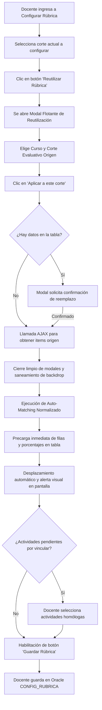

# Bitácora Día 5: Reutilización e Importación de Rúbricas entre Cursos/Grupos

Este documento describe la arquitectura técnica, la lógica de auto-matching, el flujo de persistencia, la experiencia de usuario y los componentes de interfaz desarrollados para permitir a los docentes reutilizar e importar rúbricas configuradas previamente entre distintos cursos, grupos y cortes evaluativos en Divisist.

---

## 1. Objetivo de la Jornada
Implementar una solución ergonómica e integral para que el docente pueda:
1. **Reutilizar rúbricas evaluativas** previamente configuradas en otros de sus cursos/grupos o cortes académicos hacia el corte actual.
2. **Acceder mediante una interfaz limpia y estética** a través de un botón dedicado y un modal flotante no intrusivo, evitando sobrecargar el espacio visual de trabajo.
3. **Consultar de manera dinámica** los cursos y cortes que poseen rúbricas registradas mediante llamadas asíncronas (AJAX).
4. **Mapear automáticamente actividades entre cursos de Moodle** utilizando un algoritmo de *Auto-Matching por Equals Normalizado*, resolviendo la discrepancia de IDs entre asignaturas.
5. **Manejar discrepancias de actividades**: si una actividad no coincide en nombre, conservar su porcentaje ponderado y permitir al docente seleccionarla manualmente.
6. **Optimizar la presentación visual**: consolidar el cálculo de porcentaje directamente en el pie de tabla, eliminando elementos visuales redundantes.
7. **Garantizar la estabilidad de la interfaz**: prevenir bloqueos de pantalla o capas oscuras residuales (*backdrop overlay*) durante el cierre o apertura de modales.
8. **Preservar la integridad transaccional**: la importación opera como precarga en el formulario; la persistencia en Oracle (`CONFIG_RUBRICA`) solo se ejecuta cuando el docente revisa y confirma haciendo clic en *"Guardar Rúbrica"*.

---

## 2. Mecanismo de Auto-Matching (Equals Normalizado)

### 2.1 Problema Identificado
En Moodle, cada curso asigna identificadores numéricos independientes (`id` de actividad/módulo). Por tanto, copiar IDs directamente desde un curso origen generaba inconsistencias o actividades inválidas en el curso destino.

### 2.2 Algoritmo de Coincidencia Exacta Normalizada
Para resolver la discrepancia de IDs, se diseñó e implementó un algoritmo en JavaScript del lado del cliente que compara el nombre de las actividades origen contra las actividades disponibles en Moodle para el curso actual (`actividadesDisponibles`):

```javascript
function normalizarTexto(texto) {
    if (!texto) return "";
    return texto
        .toString()
        .trim()
        .toLowerCase()
        .normalize("NFD")
        .replace(/[\u0300-\u036f]/g, "");
}
```

### 2.3 Reglas de Negocio en la Precarga
1. **Actividades Manuales:**
   - Si la actividad origen es de tipo `'manual'` o su ID es `0`, se precarga directamente en la tabla como fila manual con su nombre original y porcentaje ponderado.
2. **Coincidencia Exacta (`match` encontrado):**
   - Si el nombre normalizado de la actividad origen coincide exactamente con una actividad disponible en el curso actual, se selecciona automáticamente en el desplegable y se asigna su porcentaje. Dicha actividad queda bloqueada en los demás selectores para evitar duplicidad.
3. **Sin Coincidencia (`match` no encontrado):**
   - Se precarga la fila conservando el **porcentaje ponderado** asignado originalmente, pero dejando el selector de actividad en blanco (`-- Seleccione una actividad de Moodle --`). El docente solo debe desplegar la lista y elegir la actividad homóloga.
4. **Validación de Guardado:**
   - El botón *"Guardar Rúbrica"* permanece deshabilitado hasta que todas las filas tengan una actividad asignada (sin selecciones en blanco) y la suma sea exactamente 100%.

---

## 3. Diseño de la Interfaz y Componentes Desarrollados

### 3.1 Botón Estético de Acción Rápida
En lugar de cajas fijas que consumen espacio vertical en la pantalla, la funcionalidad se integró como un botón complementario en la barra de acciones:
- **Estilo Visual**: Tono suave y neutro (`#f4f6f8` con borde `#d0d7de`), armonizando con los botones de *"Agregar Actividad de Moodle"* y *"Agregar Actividad Manual"*.
- **Comportamiento**: Abre de forma dinámica el modal flotante de selección de origen.

### 3.2 Modal Flotante de Reutilización (`#modal_reutilizar_rubrica`)
Componente modular que contiene:
- Selector asíncrono de **Curso Origen**.
- Selector dependiente de **Corte Evaluativo Origen** (muestra la cantidad de actividades configuradas).
- Validación de corte: si se selecciona el curso en edición, deshabilita el mismo corte para evitar importaciones redundantes, pero permite seleccionar otros cortes del mismo curso.
- Botón **"Aplicar a este corte"** con validación y confirmación previa si ya existen actividades con porcentaje en la tabla.

### 3.3 Control y Limpieza de Modales (Prevención de Pantalla Negra)
Para evitar el error recurrente de Bootstrap donde capas `.modal-backdrop` huérfanas bloquean y oscurecen la pantalla tras cerrar diálogos, se implementó una rutina de saneamiento en JavaScript:

```javascript
function limpiarBackdropsModal() {
    var backdrops = document.querySelectorAll(".modal-backdrop");
    for (var i = 0; i < backdrops.length; i++) {
        if (backdrops[i] && backdrops[i].parentNode) {
            backdrops[i].parentNode.removeChild(backdrops[i]);
        }
    }
    document.body.classList.remove("modal-open");
    document.body.style.paddingRight = "";
}
```

Esta rutina se ejecuta de forma sincronizada en los cierres de modales y en el evento `hidden.bs.modal`, garantizando que la tabla y el contenido permanezcan inmediatamente accesibles y visibles.

---

## 4. Componentes del Backend

### 4.1 Modelo: `application/models/Subnotas_model.php`
- **`obtener_cursos_con_rubricas($codProfesor)`:**
  Consulta en Oracle (`CONFIG_RUBRICA`) las asignaturas, grupos, semestres y cortes configurados para el profesor:
  ```sql
  SELECT COD_MATERIA, GRUPO, SEMESTRE, TIPO_PREVIO, COUNT(*) AS TOTAL_ITEMS
  FROM CONFIG_RUBRICA 
  WHERE COD_PROFESOR = '{$codProfesor}' 
  GROUP BY COD_MATERIA, GRUPO, SEMESTRE, TIPO_PREVIO 
  ORDER BY SEMESTRE DESC, COD_MATERIA ASC, GRUPO ASC, TIPO_PREVIO ASC
  ```
- **`obtener_rubrica_origen($codProfesor, $codMateria, $grupo, $semestre, $tipoPrevio)`:**
  Recupera el detalle de actividades, tipos y porcentajes del curso y corte seleccionados como origen.

### 4.2 Controladores: `Dashboard.php` y `Calificaciones.php`
- **`listar_cursos_rubricas_ajax()`:**
  Consulta las rúbricas registradas por el docente en Oracle y obtiene los nombres descriptivos desde la API de Moodle para estructurar la lista del selector.
- **`obtener_items_rubrica_ajax()`:**
  Retorna en formato JSON las actividades y porcentajes de la rúbrica seleccionada.

### 4.3 Rutas: `application/config/routes.php`
Endpoints registrados para comunicación AJAX:
```php
$route['calificaciones/listar_cursos_rubricas_ajax'] = 'calificaciones/listar_cursos_rubricas_ajax';
$route['calificaciones/obtener_items_rubrica_ajax']   = 'calificaciones/obtener_items_rubrica_ajax';
$route['dashboard/listar_cursos_rubricas_ajax']        = 'calificaciones/listar_cursos_rubricas_ajax';
$route['dashboard/obtener_items_rubrica_ajax']         = 'calificaciones/obtener_items_rubrica_ajax';
```

---

## 5. Flujo de Trabajo del Docente



---

## 6. Comandos de Sincronización en la Máquina Virtual

Para sincronizar los archivos en la máquina virtual Linux en la ruta `$HOME/Documentos/podman/ci3/html/basecidivisist`:

```bash
TOKEN="tu_token_aqui"
BASE_URL="https://raw.githubusercontent.com/vivianaorg/Practica/main/podman/ci3/html/basecidivisist"
DESTINO="$HOME/Documentos/podman/ci3/html/basecidivisist"

curl -H "Authorization: token $TOKEN" -sSL "$BASE_URL/application/models/Subnotas_model.php" -o "$DESTINO/application/models/Subnotas_model.php"
curl -H "Authorization: token $TOKEN" -sSL "$BASE_URL/application/controllers/Dashboard.php" -o "$DESTINO/application/controllers/Dashboard.php"
curl -H "Authorization: token $TOKEN" -sSL "$BASE_URL/application/controllers/Calificaciones.php" -o "$DESTINO/application/controllers/Calificaciones.php"
curl -H "Authorization: token $TOKEN" -sSL "$BASE_URL/application/config/routes.php" -o "$DESTINO/application/config/routes.php"
curl -H "Authorization: token $TOKEN" -sSL "$BASE_URL/application/views/dashboard/configurar_rubrica.php" -o "$DESTINO/application/views/dashboard/configurar_rubrica.php"
curl -H "Authorization: token $TOKEN" -sSL "$BASE_URL/assets/js/configurar_rubrica.js" -o "$DESTINO/assets/js/configurar_rubrica.js"
curl -H "Authorization: token $TOKEN" -sSL "$BASE_URL/application/views/dashboard/calificar_rubrica_js.php" -o "$DESTINO/application/views/dashboard/calificar_rubrica_js.php"
curl -H "Authorization: token $TOKEN" -sSL "$BASE_URL/application/views/dashboard/calificar_rubrica_modal_dialog.php" -o "$DESTINO/application/views/dashboard/calificar_rubrica_modal_dialog.php"
```
